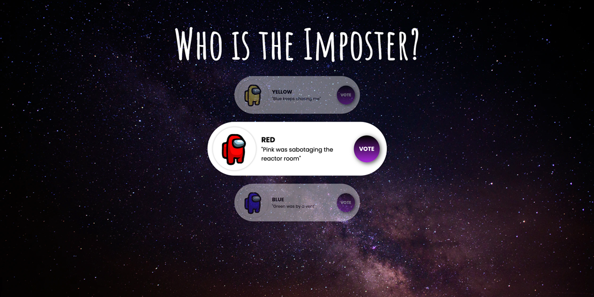

<p id="header"><p>

<table><tr>
<td> <a href="https://github.com/emjose/analog-clock-2/#header"></a> </td>
<td> <a href="https://github.com/emjose/one-hundred/#header"></a> </td>
<td> <a href="https://github.com/emjose/coffee-counter/#header"></a> </td>
</tr></table>

<br>

<p id="project-title"><p>

<a href=#table-of-contents></a> 

<br>

<a href="https://emjose.github.io/vertical-cards/"></a> 

#

<p id="table-of-contents"><p>

<a href=#table-of-contents></a>  

- [100 Days of Code](#100days)
- [Installation](#installation) 
- [Live Site](#live-site)
- [Resources](#resources)
- [Copyright](#copyright)
- [Let's Connect!](#lets-connect) 

#

<p id="100days"><p>

<a href=#100days></a>  

### Day 9: February 12, 2021
- Our <a href="https://flatironschool.com/">Flatiron School</a> cohort (**The Code Benders!**) loved playing the game <a href="https://innersloth.com/gameAmongUs.php">Among Us</a>.

- For Day 9, I applied an <a href="https://innersloth.com/gameAmongUs.php">Among Us</a> theme to a vertical card carousel of characters from the game.

#

<p id="installation"><p>

<a href=#installation></a>

#### Git clone and cd into the repo folder:
``` 
git clone git@github.com:emjose/vertical-cards.git && cd vertical-cards
```
#### Run the command:
```
open index.html
```

#

<p id="live-site"><p>

<a href="https://emjose.github.io/vertical-cards/"></a>  

<a href="https://emjose.github.io/vertical-cards/"></a>

#

<p id="resources"><p>

<a href=#resources></a>  

- #### [Google Fonts](https://fonts.google.com/)

- #### [Unsplash Stock Photos](https://unsplash.com/)

- #### [Among Us by Innersloth](https://innersloth.com/gameAmongUs.php)

- #### [Vertical Cards Tutorial](https://youtu.be/Gd7T5_3tjYQ) by [CodingNepal](https://www.youtube.com/channel/UCk7xIEmd3MeyhIu2StLX5yA)

- #### [My blog on how I created my Github READMEs](https://emmanueljose.medium.com/readme-a-makeover-story-b9c7be37a6de?sk=7ae6623d365409d875753e4604e42ffd) 

#

<p id="copyright"><p>

<a href=#copyright></a>

- This project is for made for educational purposes only. 
  
- All <a href="https://innersloth.com/gameAmongUs.php">Among Us</a> images and characters are copyright of <a href="https://innersloth.com/">Innersloth</a>. © Innersloth LLC. All Rights Reserved.

#

<p id="lets-connect"><p>

<a href=#lets-connect></a>

<p><a href="https://twitter.com/Emmanuel_Labor"> <a href="https://www.linkedin.com/in/emmanuelpjose/"> <a href="https://emmanueljose.medium.com/"> <a href="https://www.instagram.com/emmanuel_jose/"> <a href="mailto:emjose@gmail.com"> <a href="https://www.emmanuel-jose.com/"> <a href="https://github.com/emjose"></p>

#

<a href=#header></a>